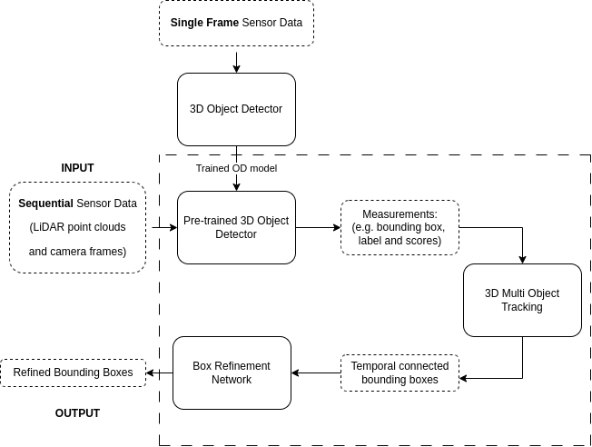

# Master Thesis 2023 - An Auto Annotation Pipeline for Automotive Data Sequences
This repository implements the pipeline and network proposed in the master thesis work at Chalmers University of Technology conducted by Amanda Allgurén and Albin Jansfelt spring of 2023. The work has been done in collaboration with Zenseact.

The project is divided into three parts AutoAnnDetector, AutoAnnTracker and AutoAnnSmoother which corresponds to the pipeline below.

Inside each separate repository you can find detailed description on how to get started with its corresponding part.